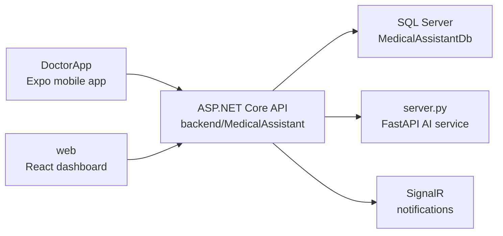

# MedBook

MedBook is a medical assistant platform made of four main parts: an ASP.NET Core backend, a React web dashboard, an Expo mobile app, and a Python FastAPI AI service. The system supports admins, doctors, secretaries, and patients with appointments, profiles, patient records, chat, notifications, reviews, and AI-assisted medical analysis.

## Project Map



## Repository Structure

```text
E:\AI
|-- backend/
|   `-- MedicalAssistant/
|       |-- MedicalAssistant.Web/             # ASP.NET Core startup project
|       |-- MedicalAssistant.Presentation/    # Controllers and SignalR hubs
|       |-- MedicalAssistant.Services/        # Business services and mapping
|       |-- MedicalAssistant.Services Abstraction/
|       |-- MedicalAssistant.Persistance/     # EF Core DbContext, migrations, repositories
|       |-- MedicalAssistant.Domain/          # Entities and repository contracts
|       |-- MedicalAssistant.Shared/          # DTOs and shared settings
|       `-- MedicalAssistant.Web Solution.sln
|-- web/
|   |-- src/
|   |   |-- api/          # Axios clients and API wrappers
|   |   |-- components/   # Layout, UI, doctor, and admin components
|   |   |-- hooks/        # Reusable React hooks
|   |   |-- pages/        # Auth, admin, doctor, and secretary pages
|   |   |-- store/        # Zustand stores
|   |   `-- lib/          # Shared frontend utilities
|   |-- e2e/              # Playwright tests
|   `-- package.json
|-- DoctorApp/
|   |-- app/              # Expo Router screens
|   |-- components/       # Mobile UI components
|   |-- services/         # Mobile API clients
|   |-- store/            # Mobile state
|   |-- __tests__/        # Jest tests
|   |-- e2e/              # Playwright mobile-web tests
|   `-- package.json
|-- MedicalAssistant.Ai/  # Alternate/experimental AI service
|-- server.py             # Main FastAPI AI service used by the backend
|-- requirements.txt      # Python deps for server.py
|-- test_ai.py            # AI service smoke test
`-- README.md
```

## Tech Stack

| Area | Stack |
| --- | --- |
| Backend API | .NET 8, ASP.NET Core, EF Core, SignalR, Swagger |
| Database | SQL Server / SQL Server Express |
| Web dashboard | React, Vite, TypeScript, Tailwind CSS, Zustand, Playwright, Vitest |
| Mobile app | React Native, Expo Router, TypeScript, Zustand, Jest |
| AI service | Python, FastAPI, Gemini, Pinecone, Pillow |

## Run Locally

### 1. AI Service

```powershell
cd E:\AI
python -m venv .venv
.\.venv\Scripts\Activate.ps1
pip install -r requirements.txt
$env:GEMINI_API_KEY="your-key"
python server.py
```

Default URL: `http://localhost:8000`

Optional smoke test:

```powershell
python test_ai.py
```

### 2. Backend API

```powershell
cd E:\AI\backend\MedicalAssistant
dotnet restore "MedicalAssistant.Web Solution.sln"
dotnet ef database update --project MedicalAssistant.Persistance --startup-project MedicalAssistant.Web
dotnet run --project MedicalAssistant.Web
```

Default API URL: `http://localhost:5194`

Swagger: `http://localhost:5194/swagger`

### 3. Web Dashboard

```powershell
cd E:\AI\web
npm install
npm run dev
```

Default URL: `http://localhost:5173`

### 4. Mobile App

```powershell
cd E:\AI\DoctorApp
npm install
npm start
```
```powershell
cd .\MedicalAssistant.Web
dotnet run --urls "http://0.0.0.0:5194"
```

Use Expo Go, an emulator, or the Expo web target.

## Useful Commands

| Task | Command |
| --- | --- |
| Build backend | `dotnet build "E:\AI\backend\MedicalAssistant\MedicalAssistant.Web Solution.sln"` |
| Run web tests | `cd E:\AI\web && npm run test` |
| Run web e2e tests | `cd E:\AI\web && npm run e2e` |
| Run mobile tests | `cd E:\AI\DoctorApp && npm test` |
| Run mobile e2e tests | `cd E:\AI\DoctorApp && npm run e2e` |

## Configuration Notes

- Backend configuration lives in `backend/MedicalAssistant/MedicalAssistant.Web/appsettings.json` and `appsettings.Development.json`.
- The backend calls the AI service through `AIService:Url`, defaulting to `http://localhost:8000`.
- The backend sends `x-internal-token` to the AI service; keep this value consistent between `Program.cs` and `server.py`.
- The mobile app derives the local API host from Expo runtime where possible.
- Move real secrets such as database passwords, JWT keys, API keys, and Cloudinary credentials to environment variables or .NET user-secrets before publishing the repository.

## Cleanup Policy

This repository keeps source code, lockfiles for real Node apps, tests, and database migrations. Generated reports, logs, local virtual environments, build output, Playwright output, model files, and temporary patch/backup files are ignored so the project stays readable.
