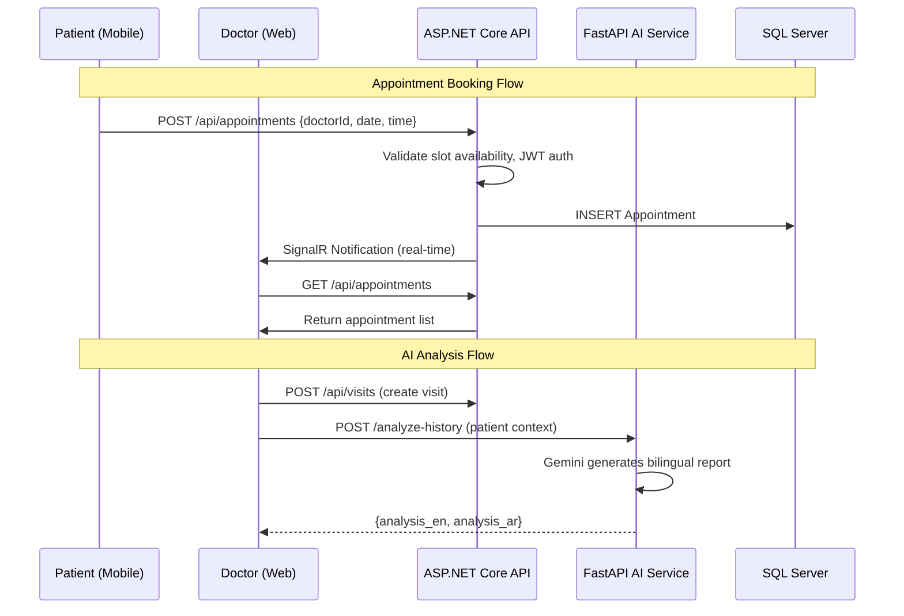
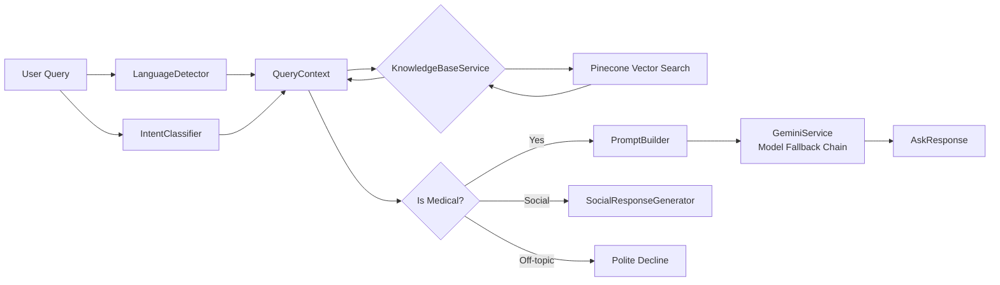
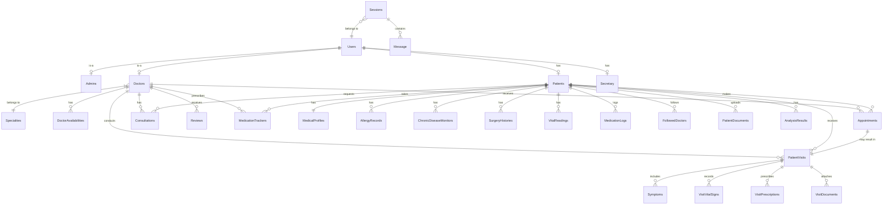
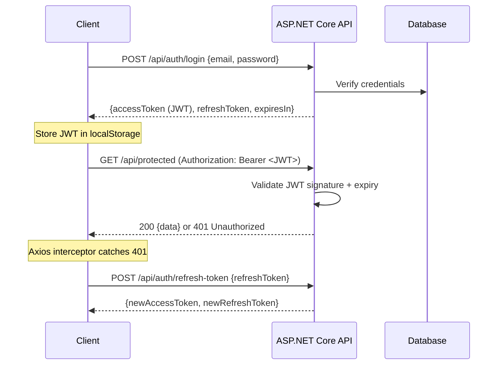
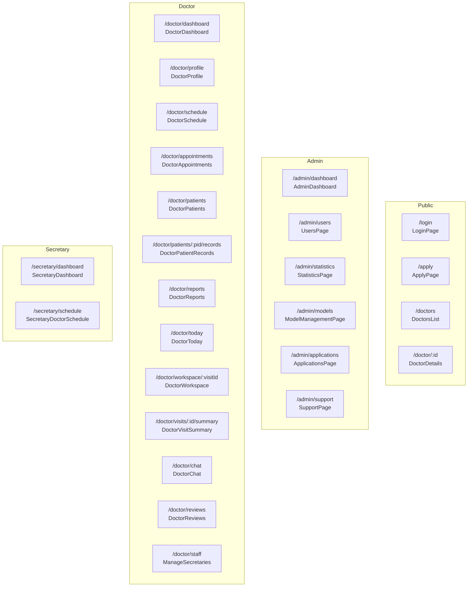
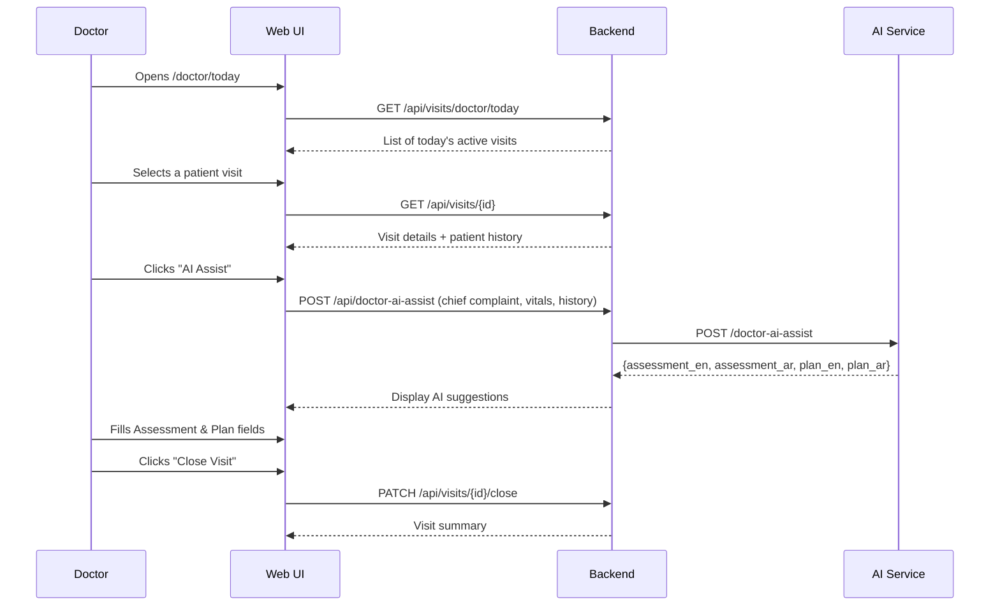
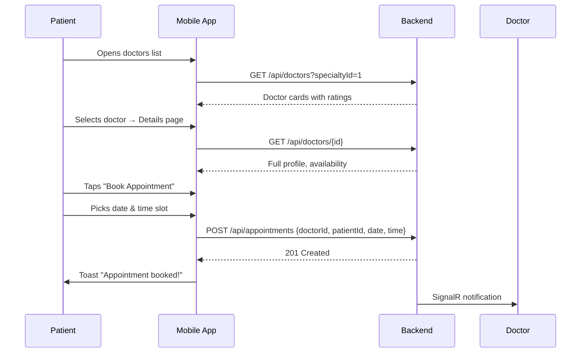
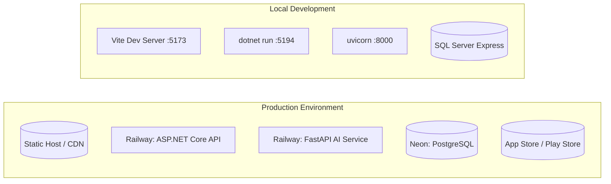

# MedBook — Medical Assistant Platform: Technical Documentation

> **Version 1.0.0**  
> **Document Type:** Software Architecture & Design Document  
> **Audience:** Academic supervisors, software engineers, system architects  
> **Last Updated:** June 2026

---

## Table of Contents

1. [Project Overview](#1-project-overview)
2. [System Architecture](#2-system-architecture)
3. [AI Component Deep Dive](#3-ai-component-deep-dive)
4. [Database Design](#4-database-design)
5. [API Reference](#5-api-reference)
6. [Frontend Structure](#6-frontend-structure)
7. [Security & Non-Functional Requirements](#7-security--non-functional-requirements)
8. [Setup & Deployment Guide](#8-setup--deployment-guide)
9. [Testing Strategy](#9-testing-strategy)
10. [Challenges & Design Decisions](#10-challenges--design-decisions)

---

## 1. Project Overview

### 1.1 Project Name & Purpose

**MedBook** is a full-stack, bilingual (Arabic/English) medical assistant platform that bridges the gap between patients, doctors, secretaries, and administrators within a unified digital ecosystem. It provides appointment management, comprehensive medical records, real-time communication, AI-powered diagnostic assistance, medication tracking, and doctor discovery.

### 1.2 Problem Statement

Healthcare management in many regions suffers from fragmentation: patients lack a centralized view of their medical history, doctors spend excessive time on administrative tasks, and communication between stakeholders is often asynchronous and uncoordinated. Existing solutions are either monolingual, lack AI integration, or fail to address the full lifecycle of patient care.

### 1.3 Target Users & Use Cases

| Role | Primary Use Cases |
|------|-------------------|
| **Patient** | Browse doctors, book appointments, chat with doctors, maintain medical records, track medications/vitals, receive AI health insights, view visit summaries |
| **Doctor** | Manage schedule, conduct visits with structured SOAP notes, view patient histories, receive AI differential diagnosis suggestions, communicate with patients and secretaries |
| **Secretary** | Manage doctor schedules, handle patient bookings, coordinate appointments |
| **Administrator** | Oversee system-wide statistics, manage user accounts, review doctor applications, monitor AI model versions, handle support cases |

### 1.4 Key Value Proposition

1. **AI-Augmented Clinical Workflow** — Doctors receive real-time AI differential diagnoses and treatment plan suggestions during patient visits, reducing cognitive load.
2. **Bilingual by Design** — Full Arabic/English support across all interfaces and AI responses, serving the MENA region healthcare market.
3. **Unified Health Record** — Patients and doctors access a longitudinal health record spanning vitals, medications, allergies, surgeries, chronic diseases, and visit history in one place.
4. **Real-Time Communication** — SignalR-powered instant messaging and notifications connect all stakeholders.
5. **Medication Adherence** — Automated reminders and logging for medication compliance, with refill threshold alerts.

---

## 2. System Architecture

### 2.1 High-Level Architecture

```mermaid
flowchart TB
    subgraph "Presentation Layer"
        WEB["React Web Dashboard<br/>(Vite + TypeScript)"]
        MOBILE["Expo React Native App<br/>(iOS + Android)"]
    end

    subgraph "API Gateway & Business Logic"
        API["ASP.NET Core 8 API<br/>localhost:5194"]
        HUB["SignalR Hub<br/>/hubs/notifications"]
    end

    subgraph "AI Layer"
        AI1["FastAPI AI Service (Primary)<br/>server.py<br/>Gemini Flash"]
        AI2["FastAPI AI Service (RAG)<br/>MedicalAssistant.Ai/main.py<br/>Gemini + Pinecone"]
    end

    subgraph "Data Layer"
        DB[(("SQL Server / PostgreSQL<br/>MedicalAssistantDb"))]
        CLOUDINARY[("Cloudinary<br/>File Storage")]
        PINECONE[("Pinecone<br/>Vector Database")]
    end

    WEB -->|HTTP/REST| API
    MOBILE -->|HTTP/REST| API
    WEB -->|WebSocket| HUB
    MOBILE -->|WebSocket| HUB
    API --> DB
    API --> CLOUDINARY
    API -->|HTTP|x-internal-token| AI1
    API -->|HTTP|x-internal-token| AI2
    AI1 -->|GOOGLE_API_KEY| GEMINI{Google Gemini}
    AI2 -->|GEMINI_API_KEY| GEMINI
    AI2 --> PINECONE
```

### 2.2 Component Breakdown

#### Backend (ASP.NET Core 8)
Clean Architecture with six projects:

| Project | Role |
|---------|------|
| `MedicalAssistant.Web` | Startup, DI configuration, middleware, Swagger, JWT auth |
| `MedicalAssistant.Presentation` | REST controllers (25), SignalR Hub, file upload filter |
| `MedicalAssistant.Services` | Business logic, AutoMapper profiles, AI integration |
| `MedicalAssistant.Services Abstraction` | Service contracts interface layer |
| `MedicalAssistant.Persistance` | EF Core DbContext, migrations, repository implementations |
| `MedicalAssistant.Domain` | Entity models, repository contracts, base entity |
| `MedicalAssistant.Shared` | DTOs, shared settings (Cloudinary) |

#### Frontend Web (React 19 + Vite + TypeScript 5)
- **Routing:** React Router DOM v7 with lazy-loaded pages, role-based guards
- **State:** Zustand v4 stores with localStorage persistence
- **HTTP:** Axios with JWT interceptor and automatic 401 redirect
- **Real-Time:** `@microsoft/signalr` v8 with automatic reconnect
- **Styling:** Tailwind CSS 3 with dark mode, Tajawal/Outfit fonts
- **Charts:** Recharts 2 for admin statistics
- **Notifications:** `react-hot-toast` for in-app toasts

#### Mobile App (Expo SDK 54 / React Native 0.81)
- **Navigation:** Expo Router 6 (file-based routing)
- **State:** Zustand v5 with AsyncStorage persistence
- **HTTP:** Custom fetch wrapper (`apiFetch`) with auth, error handling, Arabic error messages
- **Real-Time:** `@microsoft/signalr` v10
- **Push:** Firebase Cloud Messaging via `expo-notifications`
- **Theming:** Custom `ThemeContext` + `LanguageContext` for dark mode and Arabic/English

#### AI Layer (Python FastAPI)

| Service | File | Role |
|---------|------|------|
| **Primary AI** | `server.py` | Gemini Flash for Q&A, history analysis, image analysis, vitals, medication safety, doctor assist, profile parsing |
| **RAG AI** | `MedicalAssistant.Ai/main.py` | Gemini with Pinecone vector DB for strict RAG-based medical Q&A, intent classification, social awareness, image analysis |

### 2.3 Data Flow



### 2.4 Technology Stack & Justification

| Component | Technology | Justification |
|-----------|-----------|---------------|
| **Backend Framework** | ASP.NET Core 8 | Mature, high-performance, excellent DI/IoC, rich ecosystem for enterprise apps |
| **ORM** | Entity Framework Core 8 | Industry-standard for .NET, LINQ support, migration tooling, lazy loading |
| **Database** | SQL Server + PostgreSQL (Neon) | Dual support: SQL Server for local dev (familiar tooling), Neon for cloud (serverless PostgreSQL, free tier) |
| **Auth** | JWT Bearer + BCrypt | Stateless, scalable, standard claims-based auth with refresh tokens |
| **Real-Time** | SignalR | Native ASP.NET Core WebSocket, auto-transport fallback, group-based messaging |
| **Web Frontend** | React 19 + Vite + TypeScript | Latest React with concurrent features, fast HMR via Vite, type safety |
| **State Management** | Zustand | Minimal boilerplate, excellent TypeScript support, persistence middleware |
| **Mobile** | Expo (React Native) | Cross-platform (iOS + Android + Web), OTA updates, rich plugin ecosystem |
| **AI Service** | FastAPI + Gemini | High-performance async Python, native async support, Google Gemini offers generous free tier + multilingual capability |
| **Vector DB** | Pinecone | Managed, scalable vector search, ideal for RAG-based medical knowledge retrieval |
| **File Storage** | Cloudinary | Optimized image delivery, automatic transformations, generous free tier |
| **Charts** | Recharts | Declarative, composable, React-idiomatic charting |
| **Load Testing** | K6 | Developer-centric, scriptable, cloud-compatible, supports custom metrics |

---

## 3. AI Component Deep Dive

### 3.1 AI Models & Services

MedBook incorporates **two complementary AI services**, each with distinct architectural philosophies:

#### Primary AI Service (`server.py`)

| Attribute | Value |
|-----------|-------|
| **Model** | `gemini-flash-latest` (Google Gemini) |
| **API Key Source** | `GOOGLE_API_KEY` environment variable |
| **Auth** | Internal secret token (`x-internal-token` header shared with ASP.NET) |
| **Output Style** | Plain text (markdown stripped), bilingual AR/EN, emoji-enhanced sections |
| **Error Handling** | Graceful fallback messages in both languages |

**Endpoints (10 total):**

| Endpoint | Method | Purpose | Input | Output |
|----------|--------|---------|-------|--------|
| `/ask` | POST | General medical Q&A with conversation history | `{question, history[]}` | `{reply, model_used, language, disclaimer}` |
| `/analyze-history` | POST | Full patient history analysis | `{vitals, surgeries, medications, allergies, chronic_diseases, documents_analysis, recommended_doctors}` | `{analysis_en, analysis_ar}` |
| `/analyze-image` | POST | Medical image analysis (prescriptions, lab results) | Multipart: `file`, `type`, `patient_context` | `{status, analysis_ar, technical_details, disclaimer}` |
| `/summarize-surgery` | POST | Surgery description summarization | `{description}` | `{summary_en, summary_ar}` |
| `/summarize-medical-item` | POST | Refine medical descriptions | `{type, description}` | `{summary_en, summary_ar}` |
| `/analyze-vitals` | POST | Vital signs analysis with advice | `{vitals, patient_info}` | `{advice_en, advice_ar}` |
| `/check-medication-safety` | POST | Medication safety check vs history | `{medication, history}` | `{safety_en, safety_ar}` |
| `/doctor-ai-assist` | POST | Differential diagnosis + treatment plan | `{chief_complaint, history_of_illness, vitals, background}` | `{assessment_en, assessment_ar, plan_en, plan_ar}` |
| `/parse-medical-profile` | POST | NLP to structured medical data | `{text}` | `{chronic_diseases[], medications[], allergies[], summaries, follow_up}` |
| `/` | GET | Health check | — | `{status, message}` |

**Prompt Engineering Strategy:**

The AI service uses carefully constructed system prompts with these characteristics:

1. **Strict Medical Boundary Enforcement** — A hard-coded rule prevents the model from answering non-medical questions (programming, general knowledge). The model must politely decline and redirect.
2. **Active Inquiry Pattern** — When a user reports symptoms, the prompt instructs the model to **never give a final diagnosis** but instead ask 1–2 follow-up questions until a clear picture emerges, then provide safe advice with a doctor visit recommendation.
3. **JSON Constrained Output** — All analysis endpoints force the model to return valid JSON via explicit schema descriptions in the prompt. A regex-based JSON extractor (`re.search(r'\{.*\}', content, re.DOTALL)`) provides robustness against markdown-wrapped JSON.
4. **Markdown Stripping** — A post-processing function (`strip_markdown`) removes `#`, `*`, backticks, and horizontal rules to ensure clean plain-text output.
5. **Bilingual Split** — Responses are consistently split into `_en` and `_ar` fields with a strict language separation rule enforced in the prompt.

#### RAG AI Service (`MedicalAssistant.Ai/main.py` v7.0)

| Attribute | Value |
|-----------|-------|
| **Gemini Models** | `gemini-2.5-flash` → `gemini-2.0-flash` → `gemini-2.0-flash-lite` (fallback chain) |
| **Vision Models** | `gemini-2.5-flash` → `gemini-2.0-flash` → `gemini-1.5-flash` |
| **Vector DB** | Pinecone, index `medical-index` |
| **Embedding Model** | `sentence-transformers/paraphrase-multilingual-MiniLM-L12-v2` |
| **Confidence Threshold** | `MIN_CONFIDENCE` (default: 0.70) |
| **Max Query Length** | 500 characters |
| **Max Image Size** | 10 MB |

**Architecture:**



**Intent Classification System:**

The `IntentClassifier` is a zero-latency, rule-based system with five intent categories evaluated in priority order:

| Intent | Examples | Pattern Sources |
|--------|----------|-----------------|
| `GREETING` | "السلام عليكم", "Hello", "ازيك" | 30+ Arabic regex, 7 English regex |
| `GRATITUDE` | "شكراً", "Thank you", "الله يسلمك" | 6 Arabic, 7 English |
| `FAREWELL` | "مع السلامة", "Bye", "يلا سلام" | 8 Arabic, 9 English |
| `AFFIRMATION` | "تمام", "OK", "إن شاء الله" | 10 Arabic, 8 English |
| `MEDICAL` | Symptom descriptions | Keyword scanners (100+ Arabic, 60+ English) + Knowledge Base match |
| `OFF_TOPIC` | Everything else | Default fallback |

**Social Response Generator:**

Produces warm, human-like responses for non-medical interactions. Uses a deterministic but varied selection mechanism (`hash(query) % len(options)`) so the same input doesn't always receive the same response. Each social response ends with a gentle invitation to ask a medical question.

**RAG Pipeline:**

```
1. Query → Embed (SentenceTransformer) → Vector search (Pinecone) → Top-K matches
2. Matches filtered by MIN_CONFIDENCE threshold
3. If reliable match exists → Build prompt with retrieved context → Gemini generates answer
4. If no reliable match → Return "no data" response + suggest doctor consultation
5. Response caching via MD5 hash of prompt
```

### 3.2 Integration with the System

The ASP.NET Core backend communicates with the AI service via HTTP using a typed `HttpClient`:

```csharp
// Program.cs
builder.Services.AddHttpClient<IMedicalAiService, MedicalAiService>(client =>
{
    client.BaseAddress = new Uri(aiServiceUrl);
    client.Timeout = TimeSpan.FromSeconds(60);
    client.DefaultRequestHeaders.Add("x-internal-token", "LuxuryMedicalAiSecretKey2026");
});
```

The AI service validates every request:

```python
# server.py
def verify_internal_token(x_internal_token: str = Header(None)):
    if not x_internal_token or x_internal_token != INTERNAL_SECRET_KEY:
        raise HTTPException(status_code=403, detail="Forbidden")
```

> **Important Security Note:** The `x-internal-token` is shared in plaintext between services. This is an internal network communication pattern. In a production deployment, this should be replaced with mTLS or a secrets manager.

### 3.3 Mobile Fallback Strategy

The mobile app implements a **local keyword-based fallback** for the `parseMedicalProfile` function. If the AI service is unreachable, the app uses 30+ Arabic/English disease keywords, 40+ medication keywords, and 12+ allergy keywords to extract structured medical data. This ensures the profile creation flow remains functional during network outages.

---

## 4. Database Design

### 4.1 Entity Relationship Overview



### 4.2 Table & Collection Descriptions

#### Core Identity Tables

**Users** — Base identity table with Table-Per-Type (TPT) inheritance:
| Field | Type | Description |
|-------|------|-------------|
| `Id` | INTEGER PK | Auto-increment primary key |
| `FullName` | VARCHAR(120) | User's display name |
| `Email` | VARCHAR(256) UNIQUE | Login identifier |
| `PasswordHash` | VARCHAR(512) | BCrypt hash |
| `Role` | VARCHAR(20) | Admin, Doctor, Patient, Secretary |
| `PhoneNumber` | VARCHAR(20) | Contact number |
| `PhotoUrl` | TEXT | Cloudinary image URL |
| `IsActive` | BOOLEAN | Soft enable/disable |
| `IsDeleted` | BOOLEAN | Soft delete flag |
| `RefreshToken` | TEXT | JWT refresh token |
| `RefreshTokenExpiryTime` | TIMESTAMPTZ | Token expiry |
| `CreatedAt` | TIMESTAMPTZ | Row creation timestamp |

**Admins** — TPT child of Users:
| Field | Type | Description |
|-------|------|-------------|
| `Id` | INTEGER PK FK→Users | References Users.Id |
| `LastLoginAt` | TIMESTAMPTZ | Last admin login time |

**Doctors** — Medical professionals:
| Field | Type | Description |
|-------|------|-------------|
| `Id` | INTEGER PK | Auto-increment |
| `UserId` | INTEGER FK→Users | Linked user account |
| `SpecialtyId` | INTEGER FK→Specialties | Medical specialty |
| `Name` | VARCHAR(200) | Doctor's display name |
| `License` | TEXT | License or national ID |
| `Bio` | VARCHAR(1000) | Professional biography |
| `ConsultationFee` | NUMERIC(10,2) | Fee per appointment |
| `Experience` | INTEGER | Years of experience |
| `Rating` | DOUBLE | Average rating (0.0–5.0) |
| `ReviewCount` | INTEGER | Number of reviews |
| `IsAvailable` | BOOLEAN | Accepting new patients |
| `IsScheduleVisible` | BOOLEAN | Show schedule to patients |

**Patients** — Healthcare service recipients:
| Field | Type | Description |
|-------|------|-------------|
| `Id` | INTEGER PK | Auto-increment |
| `Email` | VARCHAR(150) UNIQUE | Login email |
| `PasswordHash` | TEXT | BCrypt hash |
| `DateOfBirth` | TIMESTAMPTZ | Patient's birth date |
| `Gender` | VARCHAR(10) | Patient's gender |
| `Address` | VARCHAR(300) | Home address |
| `BloodType` | VARCHAR(5) | Blood group (A+, O-, etc.) |
| `UserId` | INTEGER FK→Users | Linked user account |

**Secretary** — Doctor assistants:
| Field | Type | Description |
|-------|------|-------------|
| `Id` | INTEGER PK | Auto-increment |
| `UserId` | INTEGER FK→Users | Linked user account |
| `DoctorId` | INTEGER FK→Doctors | Assigned doctor |
| `FullName` | VARCHAR(200) | Secretary name |

#### Appointment & Visit Tables

**Appointments:**
| Field | Type | Description |
|-------|------|-------------|
| `PatientId` | INTEGER FK | Booking patient |
| `DoctorId` | INTEGER FK | Target doctor |
| `Date` | VARCHAR(20) | Appointment date |
| `Time` | VARCHAR(20) | Appointment time |
| `PaymentMethod` | VARCHAR(10) | "cash" (default) |
| `Status` | VARCHAR(20) | Pending, Confirmed, Cancelled, Completed, NoShow, Rescheduled |

**PatientVisits — Clinical encounter records:**
| Field | Type | Description |
|-------|------|-------------|
| `DoctorId` | INTEGER FK | Attending doctor |
| `AppointmentId` | INTEGER FK | Source appointment |
| `ChiefComplaint` | TEXT | Primary reason for visit (required) |
| `PresentIllnessHistory` | TEXT | HPI (history of present illness) |
| `ExaminationFindings` | TEXT | Physical exam results |
| `Assessment` | TEXT | Doctor's assessment/impression |
| `Plan` | TEXT | Treatment plan |
| `SummarySnapshot` | TEXT | AI-generated visit summary |
| `Status` | VARCHAR(20) | active, closed, cancelled |
| `ClosedAt` | TIMESTAMPTZ | Visit closure timestamp |

#### Medical Data Tables

**MedicalProfiles** — 1:1 with Patients:
| Field | Type | Description |
|-------|------|-------------|
| `PatientId` | INTEGER FK (UNIQUE) | Owning patient |
| `WeightKg` | NUMERIC(5,2) | Weight in kilograms |
| `HeightCm` | NUMERIC(5,2) | Height in centimeters |
| `IsSmoker` | BOOLEAN | Smoking status |
| `DrinksAlcohol` | BOOLEAN | Alcohol consumption |
| `EmergencyContactName/Phone/Relation` | Various | Emergency contact info |

**ChronicDiseaseMonitors:**
| Field | Type | Description |
|-------|------|-------------|
| `PatientId` | INTEGER FK | Owning patient |
| `DiseaseName` | VARCHAR(200) | Disease name |
| `DiseaseType` | VARCHAR(50) | Endocrine, Cardiovascular, etc. |
| `Severity` | VARCHAR(20) | Mild, Moderate, Severe |
| `TargetValues` | TEXT | Goal metrics |
| `MonitoringFrequency` | VARCHAR(50) | Daily, Weekly, Monthly |
| `LastCheckDate` | DATE | Last monitoring date |

**VitalReadings:**
| Field | Type | Description |
|-------|------|-------------|
| `PatientId` | INTEGER FK | Owning patient |
| `ChronicDiseaseMonitorId` | INTEGER FK (nullable) | Related disease |
| `ReadingType` | VARCHAR(30) | Blood Pressure, Heart Rate, Blood Sugar, etc. |
| `Value` | NUMERIC(8,2) | Primary reading value |
| `Value2` | NUMERIC(8,2) | Secondary (e.g., diastolic) |
| `Unit` | VARCHAR(20) | mmHg, bpm, mg/dL, etc. |
| `SugarReadingContext` | VARCHAR(20) | Fasting, Postprandial, Random |
| `IsNormal` | BOOLEAN | Flag for abnormal readings |

**MedicationTrackers:**
| Field | Type | Description |
|-------|------|-------------|
| `MedicationName` | VARCHAR(200) | Medication name |
| `Dosage` | VARCHAR(100) | e.g., "500mg" |
| `Form` | VARCHAR(30) | Tablet, Capsule, Syrup, Injection, etc. |
| `TimesPerDay` | INTEGER | Frequency count |
| `DoseTimes` | VARCHAR(200) | Specific times (JSON array or comma-separated) |
| `PillsRemaining` | INTEGER | Current stock count |
| `RefillThreshold` | INTEGER | Alert when pills ≤ threshold (default: 7) |
| `IsChronic` | BOOLEAN | Long-term medication flag |

**MedicationLogs:**
| Field | Type | Description |
|-------|------|-------------|
| `MedicationTrackerId` | INTEGER FK | Source medication |
| `ScheduledAt` | TIMESTAMPTZ | Scheduled dose time |
| `TakenAt` | TIMESTAMPTZ | Actual intake time (null if missed) |
| `Status` | VARCHAR(20) | pending, taken, missed, skipped |

#### Communication Tables

**Sessions:**
| Field | Type | Description |
|-------|------|-------------|
| `UserId` | INTEGER FK | Session owner |
| `Title` | VARCHAR(200) | Session topic |
| `UrgencyLevel` | VARCHAR(20) | LOW, MEDIUM, HIGH, EMERGENCY |
| `Type` | TEXT | consult, support, general |

**Message:**
| Field | Type | Description |
|-------|------|-------------|
| `SessionId` | INTEGER FK | Parent session |
| `Role` | VARCHAR(20) | user, model, doctor, patient |
| `Content` | TEXT | Message body |
| `MessageType` | TEXT | text, image, file |
| `AttachmentUrl` | TEXT | File URL (for non-text messages) |
| `SenderName` | VARCHAR(200) | Display name |
| `Timestamp` | TIMESTAMPTZ | Send time |

### 4.3 Relationships & Constraints

| Constraint Type | Details |
|----------------|---------|
| **Primary Keys** | All tables use auto-increment `SERIAL`/`INTEGER IDENTITY` |
| **Unique Indexes** | `Users(Email)`, `Patients(Email)`, `MedicalProfiles(PatientId)`, `FollowedDoctors(PatientId, DoctorId)` |
| **Foreign Keys** | All relationships use FK constraints with appropriate `ON DELETE CASCADE` or `ON DELETE RESTRICT` |
| **Check Constraints** | Enforced at application layer (e.g., status enums) |

### 4.4 Indexing Strategy

| Index | Purpose |
|-------|---------|
| `IX_Users_Email` | Fast login lookup (unique) |
| `IX_Patients_Email` | Fast patient lookup (unique) |
| `IX_Doctors_SpecialtyId` | Doctor discovery by specialty |
| `IX_Appointments_DoctorId` + `IX_Appointments_PatientId` | Appointment queries by role |
| `IX_PatientVisits_DoctorId_Status` | Doctor's active visit list |
| `IX_PatientVisits_PatientId_VisitDate` | Patient visit history timeline |
| `IX_VitalReadings_PatientId_ReadingType_RecordedAt` | Vital sign trend queries |
| `IX_MedicationTrackers_PatientId_IsActive` | Active medication list |
| `IX_MedicationLogs_PatientId_ScheduledAt_Status` | Daily adherence checks |
| `IX_ChronicDiseaseMonitors_PatientId_IsActive` | Active disease list |
| `IX_AllergyRecords_PatientId_IsActive` | Active allergy list |
| `IX_Messages_Timestamp` | Chat time-ordered queries |
| `IX_FollowedDoctors_PatientId_DoctorId` | Follow/unfollow uniqueness |

---

## 5. API Reference

### 5.1 Base URL

Development: `http://localhost:5194/api`  
Production: Configured via `CorsOrigins` + `ConnectionStrings` in `appsettings.json`

### 5.2 Authentication Flow



### 5.3 Endpoint Reference

#### Auth

| Method | Path | Auth | Description |
|--------|------|------|-------------|
| POST | `/api/auth/register` | None | Register new user |
| POST | `/api/auth/login` | None | Authenticate and get JWT |
| POST | `/api/auth/logout` | Bearer | Invalidate session |
| GET | `/api/auth/me` | Bearer | Get current user profile |
| POST | `/api/auth/refresh-token` | None | Refresh JWT token |

**POST /api/auth/login:**
```json
// Request
{ "email": "patient@example.com", "password": "SecurePass123" }

// Response (200)
{
  "accessToken": "eyJhbGciOiJI...",
  "refreshToken": "dGhpcyBpcyBh...",
  "expiresIn": 7,
  "user": { "id": 1, "name": "Ahmed", "email": "patient@example.com", "role": "Patient" }
}
```

#### Doctors

| Method | Path | Auth | Description |
|--------|------|------|-------------|
| GET | `/api/doctors` | None | List all doctors (optional `?specialtyId=1`) |
| GET | `/api/doctors/{id}` | None | Get doctor details |
| POST | `/api/doctors/apply` | None | Submit doctor application |
| GET | `/api/doctors/dashboard` | Doctor | Get doctor dashboard data |
| GET | `/api/doctors/profile` | Doctor | Get own profile |
| PUT | `/api/doctors/profile` | Doctor | Update profile |
| POST | `/api/doctors/photo` | Doctor | Upload profile photo |
| GET | `/api/doctors/appointments` | Doctor | Get appointments (`?status=Pending`) |
| GET | `/api/doctors/patients` | Doctor | Get patient list (`?search=term`) |
| GET | `/api/doctors/reports` | Doctor | Get AI reports (`?urgency=HIGH`) |
| GET | `/api/doctors/availability` | Doctor | Get availability schedule |
| PUT | `/api/doctors/availability` | Doctor | Update availability |
| GET | `/api/doctors/reviews` | Doctor | Get own reviews |
| PUT | `/api/doctors/schedule-visibility` | Doctor | Toggle schedule visibility |

#### Appointments

| Method | Path | Auth | Description |
|--------|------|------|-------------|
| POST | `/api/appointments` | Patient/Doctor/Secretary | Create appointment |
| GET | `/api/appointments/my` | Patient | Get my appointments |
| GET | `/api/appointments/{id}` | Bearer | Get appointment by ID |
| PATCH | `/api/appointments/{id}/status` | Doctor/Secretary | Update status (confirm/cancel/complete) |

#### Visits (Clinical Encounters)

| Method | Path | Auth | Description |
|--------|------|------|-------------|
| POST | `/api/visits` | Doctor | Open a new visit |
| GET | `/api/visits/{id}` | Doctor/Patient | Get visit details |
| PATCH | `/api/visits/{id}` | Doctor | Update visit record |
| PATCH | `/api/visits/{id}/close` | Doctor | Close a visit |
| GET | `/api/visits/{id}/summary` | Bearer | Get visit summary |
| GET | `/api/visits/{id}/summary-pdf` | Bearer | Download PDF summary |
| GET | `/api/visits/doctor/today` | Doctor | Get today's visits |

#### Patient Medical Records

| Method | Path | Auth | Description |
|--------|------|------|-------------|
| GET/PUT | `/api/medical-profiles` | Patient | Read/update medical profile |
| CRUD | `/api/allergies` | Patient | Manage allergies |
| CRUD | `/api/chronic-diseases` | Patient | Manage chronic diseases |
| CRUD | `/api/medications` | Patient | Manage medications |
| CRUD | `/api/vitals` | Patient | Record vital readings |
| CRUD | `/api/surgeries` | Patient | Manage surgery history |
| CRUD | `/api/patient-documents` | Patient | Upload medical documents |

#### Communication

| Method | Path | Auth | Description |
|--------|------|------|-------------|
| CRUD | `/api/sessions` | Bearer | Chat sessions |
| CRUD | `/api/sessions/{id}/messages` | Bearer | Session messages |
| CRUD | `/api/consultations` | Patient/Doctor | Consultation requests |
| GET | `/api/chat/{userId}` | Bearer | Direct chat with user |

#### Reviews & Social

| Method | Path | Auth | Description |
|--------|------|------|-------------|
| POST | `/api/reviews` | Patient | Submit doctor review |
| POST | `/api/follow` | Patient | Follow a doctor |
| DELETE | `/api/follow/{doctorId}` | Patient | Unfollow a doctor |

#### Admin

| Method | Path | Auth | Description |
|--------|------|------|-------------|
| GET | `/api/admin/dashboard` | Admin | System statistics |
| GET | `/api/admin/users` | Admin | List all users |
| PATCH | `/api/admin/users/{id}` | Admin | Update user status |
| DELETE | `/api/admin/users/{id}` | Admin | Delete user |
| GET | `/api/admin/applications` | Admin | List doctor applications |
| PATCH | `/api/admin/applications/{id}` | Admin | Approve/reject application |
| GET | `/api/admin/statistics` | Admin | Advanced statistics |
| GET | `/api/admin/models` | Admin | AI model version info |

#### SignalR Hub

| Hub Path | Transport | Description |
|----------|-----------|-------------|
| `/hubs/notifications` | WebSocket (with fallback) | Real-time notifications for appointments, messages, alerts |

### 5.4 Error Response Format

All endpoints return consistent error responses:

```json
// 400 Bad Request
{ "message": "Cannot book an appointment in the past." }

// 401 Unauthorized
{ "message": "Invalid token." }

// 403 Forbidden
{ "message": "Forbidden: Invalid or missing internal token" }

// 409 Conflict
{ "message": "A patient with this email already exists." }
```

### 5.5 Role-Based Access Control

| Role | Accessible Areas |
|------|-----------------|
| **Anonymous** | `/api/auth/login`, `/api/auth/register`, `/api/doctors` (list), `/api/doctors/{id}`, `/api/specialties` |
| **Patient** | Own appointments, own medical records, doctors list, reviews, consultations, chat |
| **Doctor** | Own appointments, assigned patients, own schedule, AI reports, visit workspace, staff management |
| **Secretary** | Doctor's schedule, appointment management |
| **Admin** | All users, applications, system statistics, model management, support |

---

## 6. Frontend Structure

### 6.1 Web Dashboard (React)

#### Pages & Purposes



#### Component Hierarchy

```
App
├── Toaster (react-hot-toast)
├── Routes
│   ├── PublicGuard (redirects authenticated users)
│   │   ├── LoginPage
│   │   ├── ApplyPage
│   │   ├── DoctorsList → DoctorCard
│   │   └── DoctorDetails
│   │
│   ├── AuthGuard (redirects unauthenticated)
│   │   └── DashboardLayout
│   │       ├── Sidebar (role-aware navigation)
│   │       ├── TopBar (search, notifications, user menu)
│   │       │
│   │       ├── AdminGuard
│   │       │   ├── AdminDashboard → StatCard[]
│   │       │   ├── UsersPage → UserTable, UserModal, UserForm, UserFilters
│   │       │   ├── StatisticsPage → Recharts (line, bar, pie)
│   │       │   ├── ModelManagementPage → ModelVersionTable
│   │       │   ├── ApplicationsPage
│   │       │   └── SupportPage
│   │       │
│   │       ├── DoctorGuard
│   │       │   ├── DoctorDashboard
│   │       │   ├── DoctorProfile
│   │       │   ├── DoctorSchedule → AvailabilityEditor
│   │       │   ├── DoctorAppointments → AppointmentTable
│   │       │   ├── DoctorPatients
│   │       │   ├── DoctorPatientRecords → AIReportCard
│   │       │   ├── DoctorReports
│   │       │   ├── DoctorToday
│   │       │   ├── DoctorWorkspace → SendConsultationModal
│   │       │   ├── DoctorVisitSummary
│   │       │   ├── DoctorChat
│   │       │   ├── DoctorReviews
│   │       │   └── ManageSecretaries
│   │       │
│   │       └── SecretaryGuard
│   │           ├── SecretaryDashboard
│   │           └── SecretaryDoctorSchedule
```

#### State Management (Zustand)

| Store | Persisted | Key State | Key Actions |
|-------|-----------|-----------|-------------|
| `authStore` | ✓ `medbook-auth` | user, token, role, isAuthenticated | setAuth, logout, updateUser |
| `doctorStore` | Partial | doctor data, patients, appointments | fetchDashboard, fetchPatients |
| `appointmentStore` | ✗ | appointments, filters | fetchAll, updateStatus |
| `messagesStore` | ✗ | messages, activeChat | sendMessage, loadHistory |
| `notificationStore` | ✗ | notifications, unreadCount | connect, disconnect |
| `themeStore` | ✓ `medbook-theme` | theme (light/dark) | toggleTheme |

#### API Layer Architecture

```
axiosInstance.ts        ← Axios instance with JWT interceptor + 401 handler
├── authApi.ts          ← Login, logout, me
├── doctorApi.ts        ← CRUD, appointments, patients, reports, availability, reviews
├── consultApi.ts       ← Sessions, messages, consultations, file uploads
├── visitApi.ts         ← Visit CRUD, summaries, PDF download, patient history
├── secretaryApi.ts     ← Secretary operations
├── patientRecordsApi.ts ← Patient medical records
└── adminApi.ts         ← User management, statistics, applications, models
```

#### UI Component Library

All components in `src/components/ui/` are designed to be reusable, accessible, and theme-aware:

| Component | Features |
|-----------|----------|
| **Badge** | Color variants (success, warning, error, info, neutral), dot indicator |
| **Button** | Variants (primary, secondary, outline, ghost), sizes, loading state |
| **Card** | Bordered/flat variants, header/content/footer slots |
| **Input** | Label, error state, icon prefix, dark mode support |
| **Modal** | Portal-based, overlay click to close, focus trap, animation |
| **Pagination** | Page numbers, prev/next, first/last, configurable page size |
| **Select** | Searchable, clearable, custom option rendering |
| **Skeleton / SkeletonCard** | Loading placeholder with shimmer animation |
| **Table** | Sortable headers, row click, responsive scroll, empty state |
| **LoadingSpinner** | Full-page and inline variants |

#### Key User Flows

**Doctor Visit Workflow:**


**Patient Appointment Booking (Mobile):**


### 6.2 Mobile App (Expo Router)

#### Navigation Structure

```
app/
├── _layout.tsx            ← Root layout (providers, fonts)
├── index.tsx              ← Splash / redirect
├── onboarding.tsx         ← First-launch onboarding
│
├── (auth)/
│   ├── _layout.tsx        ← Auth stack navigator
│   ├── login.tsx
│   └── register.tsx
│
├── (doctor)/              ← Doctor role stack
│   ├── _layout.tsx
│   ├── index.tsx          ← Doctor dashboard
│   ├── ai-reports.tsx
│   ├── profile.tsx
│   ├── schedule.tsx
│   ├── visit-summary.tsx
│   └── workspace.tsx
│
└── (patient)/             ← Patient role stack
    ├── _layout.tsx
    ├── home.tsx            ← Patient home (doctors, SOS, medications)
    ├── chatbot.tsx         ← AI chat interface
    ├── doctors.tsx
    ├── doctor-details.tsx
    ├── followed-doctors.tsx
    ├── medications.tsx
    ├── vitals.tsx
    ├── messages.tsx
    ├── profile.tsx
    ├── ai-profile-assistant.tsx  ← NLP medical profile creation
    ├── visit-summary.tsx
    └── medical-records/
```

#### Mobile Services Layer (19 files)

```
services/
├── http.ts               ← Core fetch wrapper with JWT, 401 handling, Arabic errors
├── authService.ts
├── aiService.ts          ← AI integration + local keyword fallback
├── appointmentService.ts
├── chatService.ts
├── doctorService.ts
├── signalr.ts            ← SignalR connection management
├── medicationReminderService.ts  ← Push notification scheduling
├── appointmentReminders.ts       ← Appointment reminder scheduling
└── ... (10 more service files)
```

#### Mobile UI Components

| Component | Description |
|-----------|-------------|
| `DoctorCard` | Doctor listing card with rating, specialty, availability |
| `CategoryCard` | Specialty browser grid |
| `SearchBar` | Debounced search input |
| `RatingStars` | Interactive star rating display |
| `SosBar` | Emergency contact quick-access bar |
| `NotificationBell` | Unread count badge with SignalR integration |
| `TabBar` | Custom bottom tab navigation |
| `CustomButton` | Theme-aware button with loading state |

---

## 7. Security & Non-Functional Requirements

### 7.1 Authentication

**JWT-Based Authentication:**
- **Algorithm:** HMAC-SHA256 (symmetric key)
- **Key Requirements:** Minimum 32 characters, configured in `Jwt:Key`
- **Token Lifetime:** 7 days (configurable via `Jwt:ExpiresInDays`)
- **Refresh Tokens:** Rotating refresh tokens stored in DB, revokable
- **Claims:** `UserId`, `Role`, `PatientId`, `DoctorId` (role-specific)

**Token Validation:**
```csharp
options.TokenValidationParameters = new TokenValidationParameters
{
    ValidateIssuer = true,
    ValidateAudience = true,
    ValidateLifetime = true,
    ValidateIssuerSigningKey = true,
    ValidIssuer = "MedicalAssistant",
    ValidAudience = "MedicalAssistantApp",
    IssuerSigningKey = new SymmetricSecurityKey(Encoding.UTF8.GetBytes(jwtKey))
};
```

**SignalR Token Flow:**
The JWT is passed as a query parameter (`access_token`) for WebSocket connections, handled via a custom `OnMessageReceived` event that detects the `/hubs/notifications` path.

**Password Security:**
- BCrypt hashing with work factor (default cost)
- No plaintext passwords stored
- No password complexity requirements in current version (noted as improvement area)

### 7.2 Authorization

Role-based access control enforced at two levels:
1. **Controller Level:** `[Authorize(Roles = "Doctor")]` attributes
2. **UI Level:** `RoleGuard` component in React that conditionally renders routes

The backend has a **centralized role check** pattern: controllers verify the role claim from the JWT before executing sensitive operations.

### 7.3 Data Validation & Sanitization

| Layer | Mechanism |
|-------|-----------|
| **ASP.NET** | `[ApiController]` automatic model validation, `ModelState.IsValid` checks |
| **ASP.NET** | Manual validation in controllers (e.g., date range checks for appointments) |
| **FastAPI** | Pydantic models with `@field_validator` decorators (e.g., `AskRequest.validate_text`) |
| **React** | Client-side validation via HTML5 input attributes and custom validation in forms |
| **Mobile** | Validation in service layer before API calls |
| **SQL** | Parameterized queries via EF Core (prevents SQL injection) |
| **AI Output** | Markdown stripping to prevent injection of formatting characters into medical reports |

### 7.4 Performance Considerations

1. **Lazy Loading** — All React pages are lazy-loaded with `React.lazy()` and `Suspense`, reducing initial bundle size
2. **SignalR Reconnection** — Exponential backoff strategy: `[0, 2000, 5000, 10000, 30000]` milliseconds
3. **AI Timeout** — 60-second timeout on AI HTTP client calls
4. **Database Retry** — EF Core configured with `EnableRetryOnFailure()` for transient fault handling
5. **Pagination** — All list endpoints support pagination with configurable page sizes (10, 20, 50)
6. **Response Caching** — The RAG AI service caches responses by MD5 hash of the prompt
7. **Image Optimization** — Cloudinary handles image transformation and CDN delivery

### 7.5 Scalability Notes

| Component | Scalability Approach |
|-----------|---------------------|
| **ASP.NET Core API** | Stateless (JWT-based), horizontally scalable behind load balancer |
| **SignalR** | Requires sticky sessions or Redis backplane for multi-instance |
| **SQL Server** | Can scale vertically; consider read replicas for reporting queries |
| **FastAPI AI** | Stateless, horizontally scalable; consider GPU instances for lower latency |
| **React Web** | Static build served via CDN, fully client-side |
| **File Storage** | Cloudinary handles CDN and scaling |

**Current Limitations:**
- No Redis cache layer for API responses
- No rate limiting on AI endpoints
- SignalR requires sticky sessions in multi-instance deployments
- No request queue for AI service under high load

---

## 8. Setup & Deployment Guide

### 8.1 Prerequisites

| Component | Requirement |
|-----------|-------------|
| **Runtime** | .NET 8 SDK, Python 3.11+, Node.js 20 LTS |
| **Database** | SQL Server Express (local) or PostgreSQL/Neon (cloud) |
| **Mobile** | Expo CLI, Android Studio (Android) or Xcode (iOS) |
| **AI API** | Google Gemini API key |
| **Optional** | Pinecone API key (for RAG service), Cloudinary account (for file storage) |

### 8.2 Local Development Setup

#### Step 1: AI Service (Primary)

```powershell
# Navigate to root
cd E:\AI

# Create and activate virtual environment
python -m venv .venv
.\.venv\Scripts\Activate.ps1

# Install dependencies
pip install -r requirements.txt

# Set API key
$env:GOOGLE_API_KEY="your-gemini-api-key"

# Start the service
python server.py
# => http://localhost:8000
```

#### Step 2: Backend API

```powershell
cd E:\AI\backend\MedicalAssistant

# Restore packages
dotnet restore "MedicalAssistant Web Solution.sln"

# Configure database in appsettings.json
# Ensure SQL Server is running with: Server=.\SQLEXPRESS;Database=MedicalAssistantDb

# Apply migrations
dotnet ef database update --project MedicalAssistant.Persistance --startup-project MedicalAssistant.Web

# Run the API
dotnet run --project MedicalAssistant.Web
# => http://localhost:5194
# => Swagger: http://localhost:5194/swagger
```

#### Step 3: Web Dashboard

```powershell
cd E:\AI\web

# Install dependencies
npm install

# Configure .env
# VITE_API_BASE_URL=http://localhost:5194
# VITE_SIGNALR_HUB_URL=http://localhost:5194/hubs/notifications

# Start dev server
npm run dev
# => http://localhost:5173
```

#### Step 4: Mobile App

```powershell
cd E:\AI\DoctorApp

# Install dependencies
npm install

# Start Expo
npm start
# => Expo Dev Tools at http://localhost:8081
# => Scan QR code with Expo Go, or press 'w' for web
```

#### Step 5: Verify AI Integration

```powershell
# From root directory
python test_ai.py
# => [OK] AI Server is ALIVE!
# => [OK] Bilingual support confirmed!
# => [OK] Clean text output confirmed (No Markdown).
```

### 8.3 Environment Variables Reference

| Variable | Component | Required | Default | Description |
|----------|-----------|----------|---------|-------------|
| `GOOGLE_API_KEY` | AI Service (server.py) | Yes | — | Google Gemini API key |
| `GEMINI_API_KEY` | AI Service (RAG) | Yes | — | Google Gemini API key |
| `PINECONE_API_KEY` | AI Service (RAG) | Yes | — | Pinecone vector DB key |
| `PINECONE_INDEX` | AI Service (RAG) | No | `medical-index` | Pinecone index name |
| `MIN_CONFIDENCE` | AI Service (RAG) | No | `0.70` | Knowledge match confidence threshold |
| `VITE_API_BASE_URL` | Web Dashboard | No | `http://localhost:5194` | Backend API URL |
| `VITE_SIGNALR_HUB_URL` | Web Dashboard | No | `http://localhost:5194/hubs/notifications` | SignalR hub URL |
| `VITE_APP_NAME` | Web Dashboard | No | `MedBook` | Application display name |
| `AIService:Url` | Backend (appsettings) | No | `http://localhost:8000` | AI service URL |
| `Jwt:Key` | Backend (appsettings) | Yes | — | JWT signing key (≥32 chars) |
| `Cloudinary:ApiSecret` | Backend (appsettings) | Yes | — | Cloudinary API secret |

### 8.4 Deployment Architecture



**Production Deployment Considerations:**

1. **Backend** — Deploy to Railway using the `NeonConnectionBackup` connection string for PostgreSQL
2. **AI Service** — Deploy separately to Railway/Heroku; the `railway.json` configures Nixpacks builder with health check at `/health`, 120s timeout, and restart on failure (max 3 retries)
3. **Web Dashboard** — Build with `npm run build` and serve from any static host (Vercel, Netlify, Railway Static)
4. **Mobile App** — Distribute via Google Play Store and Apple App Store using Expo build services
5. **CORS** — Ensure production URLs are added to `CorsOrigins` in `appsettings.json`
6. **Secrets** — Move all secrets (DB passwords, JWT keys, API keys, Cloudinary secrets) to environment variables or .NET User Secrets

---

## 9. Testing Strategy

### 9.1 Test Scope & Execution

| Layer | Framework | Location | Run Command |
|-------|-----------|----------|-------------|
| Web Unit (Vitest) | Vitest + React Testing Library | `web/src/test/`, `web/src/store/`, `web/src/lib/`, `web/src/api/`, `web/src/components/` | `cd web && npm run test` |
| Web E2E | Playwright | `web/e2e/` | `cd web && npm run e2e` |
| Mobile Unit | Jest + React Native Testing Library | `DoctorApp/__tests__/` | `cd DoctorApp && npm test` |
| Mobile E2E | Playwright + Detox | `DoctorApp/e2e/` | `cd DoctorApp && npm run e2e` |
| AI Smoke | Pytest | `test_ai.py` | `python test_ai.py` |
| Load | K6 | `tests/load-test.js` | `k6 run tests/load-test.js` |

### 9.2 Web Test Coverage

```
web/src/
├── test/setup.ts             ← Vitest + jsdom configuration
├── store/
│   └── authStore.test.ts     ← Auth state CRUD + persistence
├── lib/
│   └── utils.test.ts         ← Utility function tests
├── api/
│   ├── authApi.test.ts       ← Login/logout/me API wrappers
│   └── doctorApi.test.ts     ← Doctor API CRUD
├── components/ui/
│   ├── Badge.test.tsx        ← Render variants + aria attributes
│   ├── Button.test.tsx       ← Click handlers + disabled state
│   ├── Card.test.tsx         ← Content rendering
│   ├── Input.test.tsx        ← Value changes + error display
│   ├── LoadingSpinner.test.tsx ← Render + accessibility
│   └── Select.test.tsx       ← Option selection + change events
└── integration/
    ├── auth.integration.test.tsx  ← Full login flow
    ├── doctor.integration.test.tsx ← Doctor data flows
    └── forms.integration.test.tsx  ← Form validation + submission
```

### 9.3 AI Smoke Test (`test_ai.py`)

The smoke test validates:
1. AI server connectivity (`POST /analyze-history`)
2. Bilingual response (both `analysis_en` and `analysis_ar` fields present)
3. Markdown cleaning (no `#` or `*` characters in output)

### 9.4 Load Testing (K6)

Three scenarios defined in `tests/load-test.js`:

| Scenario | VUs | Duration | Purpose |
|----------|-----|----------|---------|
| **Smoke** | 5 | 30s | Quick sanity check |
| **Average Load** | 0→50→0 (ramp) | 2m | Normal traffic simulation |
| **Stress** | 0→100→200→0 (ramp) | 1m 10s | Peak traffic simulation |

**Thresholds:**
- `http_req_duration`: p(95) < 3000ms
- `http_req_failed`: rate < 5%
- `errors` (custom): rate < 10%
- `login_duration`: p(95) < 2000ms
- `health_check_duration`: p(95) < 500ms

**Endpoints Tested:** Backend health, AI health, login, AI chat, authenticated API calls

---

## 10. Challenges & Design Decisions

### 10.1 Key Technical Decisions

#### Decision 1: Dual AI Service Architecture

**Choice:** Two separate Python FastAPI services — a simple Gemini proxy (`server.py`) and a full RAG system (`MedicalAssistant.Ai/main.py`).

**Rationale:** The primary service provides low-latency, lightweight AI capabilities with minimal dependencies. The RAG service adds retrieval-augmented generation for more trustworthy, context-grounded medical answers. This separation allows independent scaling and deployment — the RAG service (with its Pinecone vector DB) can be deployed only when the medical knowledge base is populated.

**Trade-off:** Increased operational complexity. Two services to monitor, two sets of environment variables, two deployment configurations.

#### Decision 2: Clean Architecture with .NET 8

**Choice:** Six-project solution following Clean Architecture principles (Domain → Persistence → Services → Services Abstraction → Presentation → Web).

**Rationale:** Academic and enterprise projects benefit from strict separation of concerns. Domain entities have zero external dependencies. Controllers depend only on abstractions (service interfaces). This enables testability (services can be mocked), maintainability (changes to EF Core don't ripple through the stack), and future-proofing (switching from SQL Server to PostgreSQL required only configuration changes).

#### Decision 3: Bilingual by Design, Not Translation

**Choice:** All AI prompts request responses in both languages simultaneously with strict separation rules. The UI stores strings in both languages and detects user preference via `Accept-Language` header and `LanguageContext`.

**Rationale:** The platform targets Arabic-speaking users in the MENA region. Rather than building a translation layer (which adds latency and cost), the AI model natively generates responses in both languages from a single API call. The `LanguageDetector` in the RAG service identifies and responds in the user's language.

**Verification:** The smoke test (`test_ai.py`) explicitly validates that both `analysis_en` and `analysis_ar` fields are present in the response.

#### Decision 4: Zustand Over Redux

**Choice:** Zustand for state management on both web and mobile, with `persist` middleware for auth/theme.

**Rationale:** Zustand requires dramatically less boilerplate than Redux, has first-class TypeScript support, and its `persist` middleware integrates directly with `localStorage` (web) and `AsyncStorage` (mobile). For a project of this scope — where state is primarily server-backed (appointments, patients, messages) — the centralized store model of Redux was unnecessary overhead.

#### Decision 5: Cloudinary for File Storage

**Choice:** Cloudinary for all file uploads (profile photos, doctor documents, visit attachments).

**Rationale:** Cloudinary provides automatic image optimization, responsive delivery via CDN, and a generous free tier. Offloading file storage frees the application servers from handling binary data and eliminates the need for dedicated file server infrastructure. The integrations are encapsulated behind `IPhotoService`, making it swappable.

### 10.2 Alternatives Considered

| Decision | Considered Alternatives | Why Rejected |
|----------|------------------------|--------------|
| **AI Model** | OpenAI GPT-4, Claude, Llama 3 | Gemini offers superior Arabic support, higher free-tier quotas, and native multimodal capabilities |
| **Database** | MongoDB (NoSQL) | Medical data is highly relational (patient → visits → prescriptions → medications); relational integrity is critical |
| **Backend** | Node.js/Express, FastAPI (Python) | .NET 8 provides superior performance, built-in DI, SignalR integration, and matches the enterprise stack requirements |
| **Frontend State** | Redux Toolkit, Context API | Redux: excessive boilerplate. Context: re-render performance issues at scale |
| **Mobile Framework** | Flutter, Kotlin Multiplatform | React Native/Expo allowed code sharing with the web team (same state management, same SignalR library) |
| **Real-Time** | WebSocket (raw), Socket.io | SignalR is natively integrated with ASP.NET Core and handles transport fallback automatically |

### 10.3 Known Limitations

1. **Rate Limiting** — Neither the ASP.NET Core API nor the FastAPI AI service implements request rate limiting. Under sustained high load, the AI service could exceed Gemini's rate limits (which are generous for `gemini-flash-latest` but not unlimited).

2. **No Redis/Session Backplane** — The SignalR hub does not use a Redis backplane, meaning multi-instance deployments require sticky session affinity.

3. **Password Policy** — No minimum password complexity requirements beyond the registration schema. BCrypt hashing is used, but policy enforcement (special characters, minimum length) is absent.

4. **Audit Logging** — There is no centralized audit trail for sensitive operations (user deletion, role changes, medical record modifications).

5. **Offline Mode** — The mobile app has limited offline capabilities. The local fallback for medical profile parsing is the only offline feature.

6. **AI Hallucination Risk** — Despite prompt engineering safeguards (strict medical boundaries, no-final-diagnosis rules), Gemini can still produce plausible-sounding but incorrect medical advice. The disclaimer appended to every response is the primary mitigation.

7. **Multi-Tenancy** — The current architecture supports a single organization. Future work would need to introduce organization/tenant isolation at the database and authentication level.

8. **CI/CD Pipeline** — No automated CI/CD configuration is present in the repository. Deployment is currently manual.

---

> **Document Prepared By:** Automated Technical Documentation System  
> **Based On:** Source code analysis of E:\AI repository  
> **Date:** June 2026  
> **Review Note:** This document is intended for academic evaluation. For questions about specific implementation details, refer to the source code or contact the development team.
